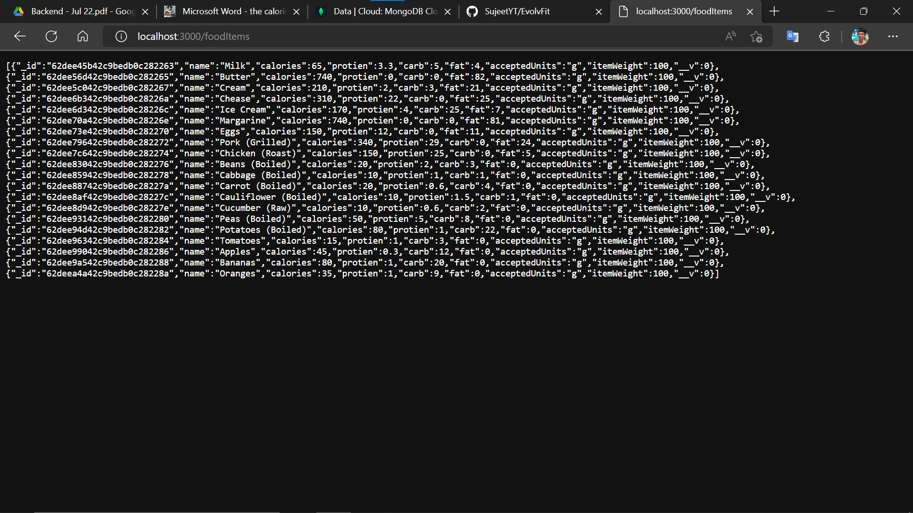
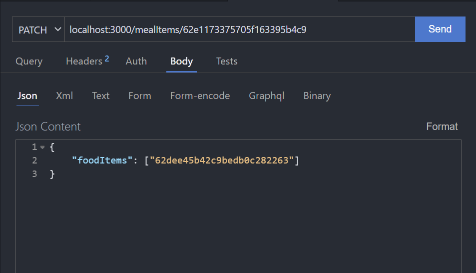
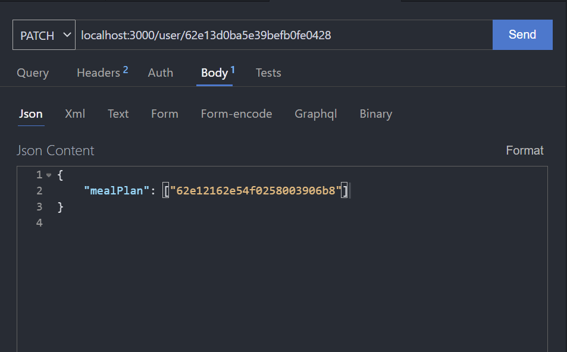
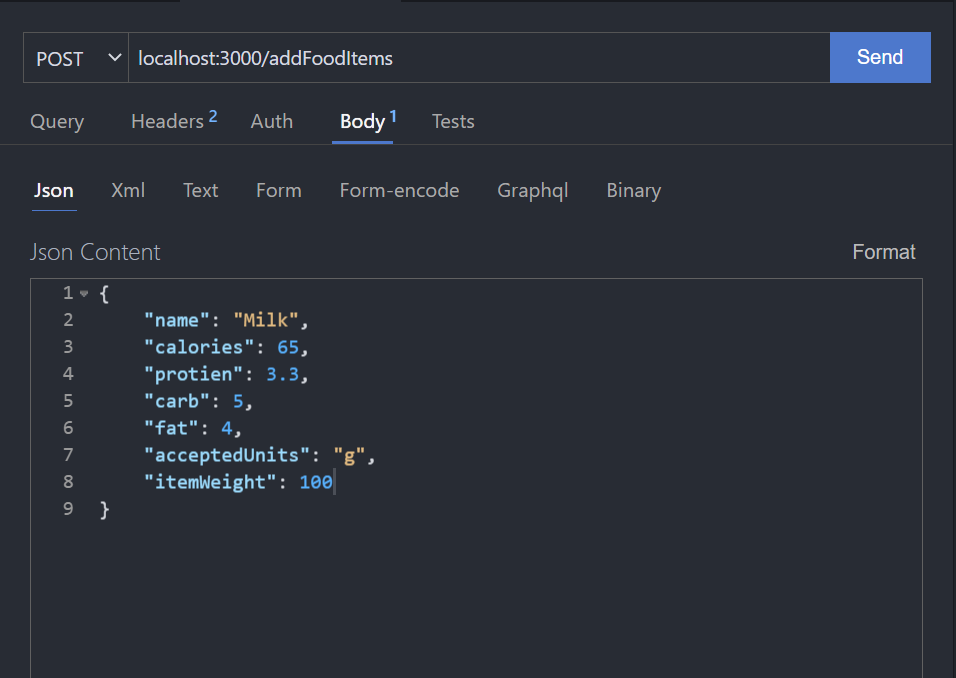
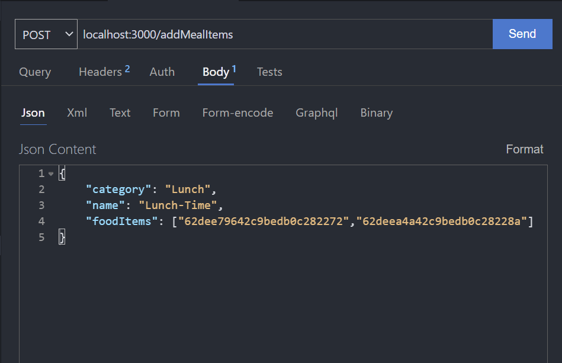
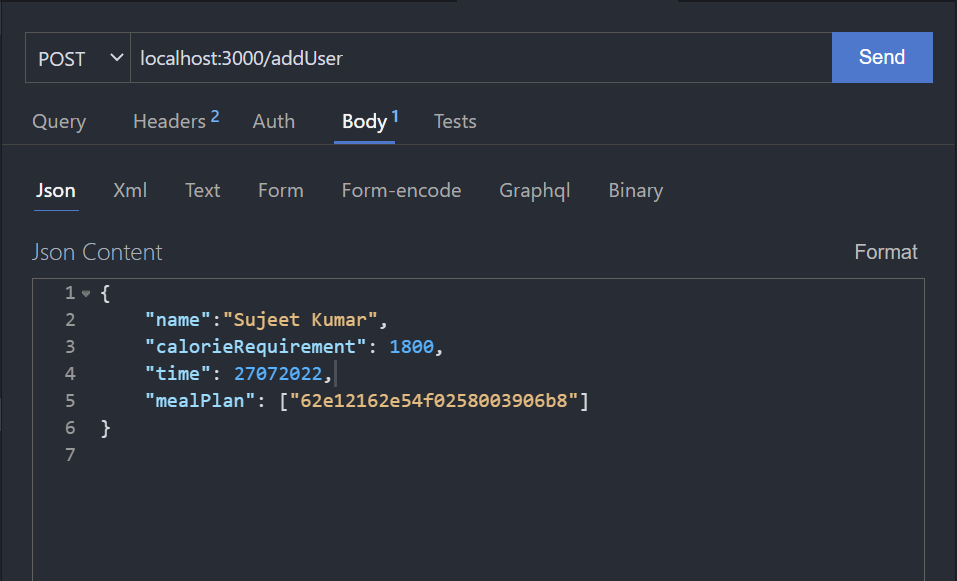

# EvolvFit

Note :- **.env** file has been ignored via .gitignore

Please make your own .env file and create your own data by referring the schema in **/models** folder

## Create .env file in windows
Using Command Line

``` 
echo >> .env 
```
Setup your own Database on MongoDB and paste the URL in .env
```
URL=<Your_MongoDB_Connection_URL>
```

## Run backend on localhost
Using the following Command Line

Install Dependencies 
```
npm i
```
Run Backend
```
npm start
```
### Tech Stack Used
> NodeJs, ExpressJs, MongoDB

# Follow the given tutorial to access the routes







